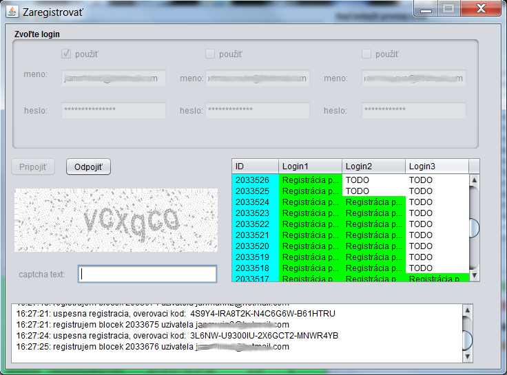

# RegistratorBlockov
java desktop app for fast collection of data from receipts for National receipts lottery and their fast automatic registration

Program ponuka velmi dobry interface na rychle zadavanie udajov z blocka a ich naslednu registraciu na webe narodnej blockovej loterie.

Program je zastarany pretoze sposob registrovania blockov sa zmenil (r. 2016) a projekt je mrtvy, planujem spravit program na automaticke nacitavanie udajov z blocku cez kameru.

Captcha kod sa pocital na zaklade mp3 verzie captcha s uspesnostou 95%.

